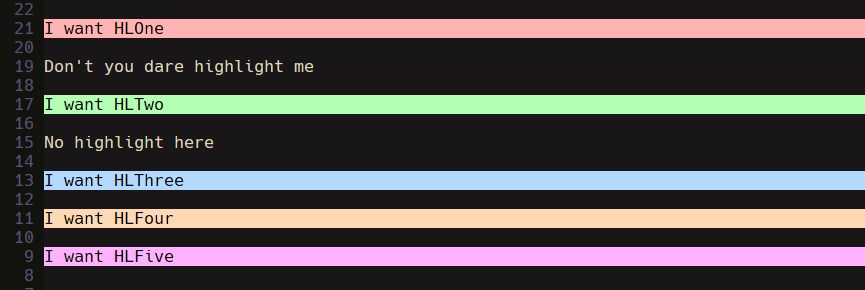
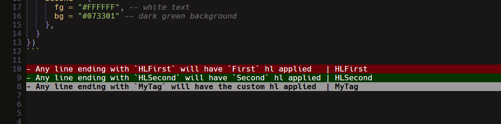

# instacolor.nvim

Set up auto-highlights in specific files/filetypes based on trailing comments



## Installation with `lazy.nvim`
- See bottom of README.md for config with all values
```lua
{
  'fluxdiv/instacolor.nvim',
  config = function()
    require('instacolor').setup({
      line_check = function(line)
        -- see section about line_check below
      end,
      files = {"*.md", "myfile.txt"},
      hl_config = {
        SomeHighlightName = {
          bg = "#000000",
          fg = "#000000",
          -- see vim.api.keyset.highlight for all fields or bottom of README.md
        }
      }
    })
  end,
}
```

## `config.files`

- Indicates files that instacolor should run on
- Supports glob matching
- `files` field is directly passed to `pattern` in `nvim_create_autocmd`
```lua
require("instacolor").setup({
  files = {"*.md", "myfile.txt"},
  hl_config = {
    MyCustomValue = { 
      bg = "#000000",
    },
  },
})
```

## `config.hl_config` and `config.line_check(line)`

### `config.hl_config`

- You can define highlights using `config.hl_config: table<string, vim.api.keyset.highlight>`
- The key of each entry can be used to look up a highlight in the `line_check` function
- The value of each entry defines the highlight

### `config.line_check(line)`

- Returns: `string | table: vim.api.keyset.highlight | nil`
- By default, lines ending in `IC<key>` will be matched on, and the highlight defined in `hl_config[key]` will be applied (if it exists)
- You can define your own matching logic with `config.line_check(line)`
  - `line` is a string containing the text of each line
  - If `nil`, no highlight will be applied
  - If `string`, `hl_config[string]` will be applied
  - If `table`, the highlight returned will be applied

### Example:

If your config is:

```lua
require("instacolor").setup({
  files = {"*.md"},
  line_check = function(line)
    -- Match on HL<key>, apply hl_config<key> to line
    local hl_match = line:match("HL([%a%d_]+)$")
    if hl_match then return hl_match end

    -- Return custom highlight when "MyTag" is at the end of a line
    local mytag_match = line:match("MyTag$")
    if mytag_match then
      return {
        fg = "#000000", -- black text
        bg = "#9c9a9a", -- gray background
        bold = true,
      }
    end

    -- No match
    return nil
  end,
  hl_config = {
    First = {
      fg = "#FFFFFF", -- white text
      bg = "#6b0009" -- dark red background
    },
    Second = {
      fg = "#FFFFFF", -- white text
      bg = "#073301" -- dark green background
    },
  }
})
```

- Any line ending with `HLFirst` will have `First` hl applied   | HLFirst
- Any line ending with `HLSecond` will have `Second` hl applied | HLSecond
- Any line ending with `MyTag` will have the custom hl applied  | MyTag



### Example config with all fields

```lua
require('instacolor').setup({
  line_check = function(line)
    -- Default line_check behavior, matches lines ending in `IC<key>`
    return line:match("IC([%a%d_]+)$")
  end,
  files = {"*.md"},
  hl_config = {
    MyCustomHighlightName = {
      fg = "#000000",
      bg = "#000000",
      sp = "#000000",
      blend = 100, -- integer between 0 and 100
      bold = false,
      standout = false,
      underline = false,
      undercurl = false,
      underdouble = false,
      underdotted = false,
      underdashed = false,
      strikethrough = false,
      italic = false,
      reverse = false,
      nocombine = false,
      link = "", -- name of another hl group to link to, see `:hi-link`,
      default = false, -- don't override existing definition, see `:hi-default`
      ctermfg = "",
      ctermbg = "",
      -- cterm = cterm attribute map, like `highlight-args`
      force = false, -- force update the hl group when it exists
    }
  }
})
```
